# Polyclinic Web

## Описание

Polyclinic Web - это веб-приложение для управления поликлиникой, разработанное на Java с использованием JSP, Apache Tomcat и Oracle Database. Система позволяет управлять записями на прием, медицинскими картами, расписанием врачей и пользователями системы.

## Особенности

- 🔒 Система ролей и управления пользователями 
    - 👨‍💻 Системный администратор
    - 👮 Модератор
    - 👨‍💼 Администратор поликлиники
    - 👨‍⚕️ Врач
    - 👤 Пациент
- 📅 Система записи на прием к врачу
- 📋 Управление медицинскими картами
- 👨‍⚕️ Управление специализациями врачей
- 📊 Расписание работы врачей
- 🏖️ Система управления отпусками
- 🌐 Веб-интерфейс на JSP

## Галерея

<details>
<summary>🔐 Аутентификация и авторизация</summary>

<figure>
<figcaption>Страница входа в систему:</figcaption>

</figure>

<figure>
<figcaption>Страница профиля пользователя:</figcaption>
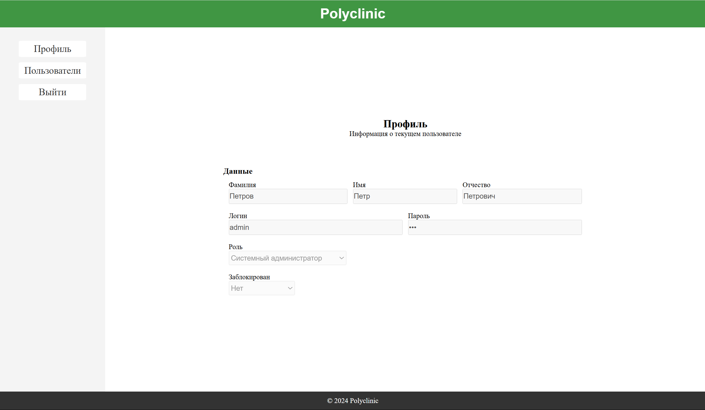
</figure>
</details>

<details>
<summary>👤 Возможости системного администратора и модератора</summary>

<figure>
<figcaption>Список пользователей системы:</figcaption>
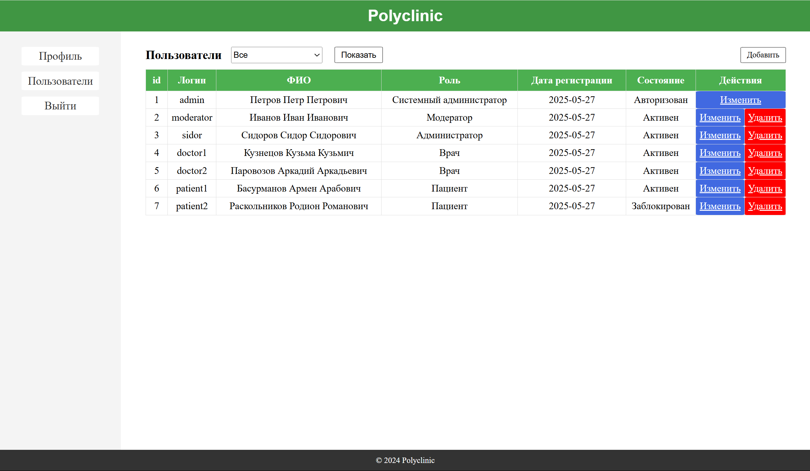
</figure>

<figure>
<figcaption>Обновление данных пользователя:</figcaption>
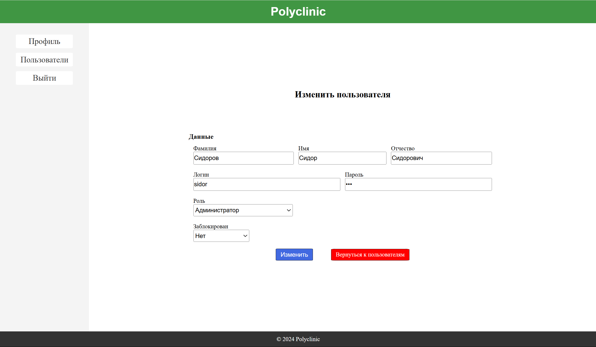
</figure>

<figure>
<figcaption>Удаление пользователя из системы:</figcaption>
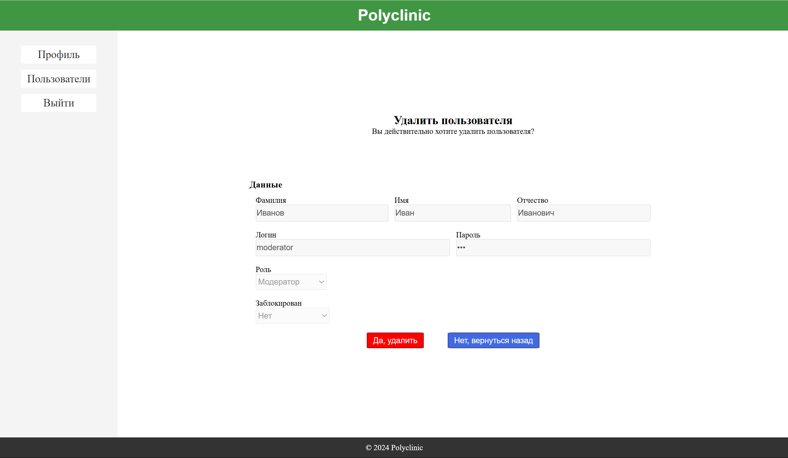
</figure>
</details>

<details>
<summary>📋 Возможности администратора поликлиники</summary>

<figure>
<figcaption>Управление врачами поликлиники:</figcaption>
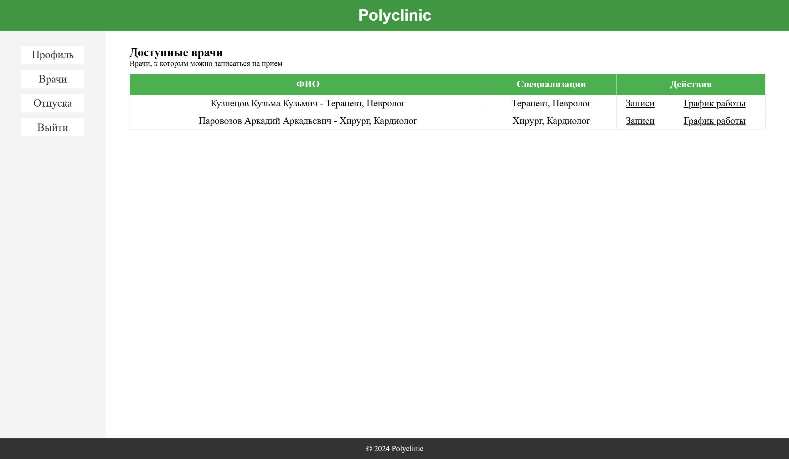
</figure>

<figure>
<figcaption>Просмотр и управление записями на прием:</figcaption>
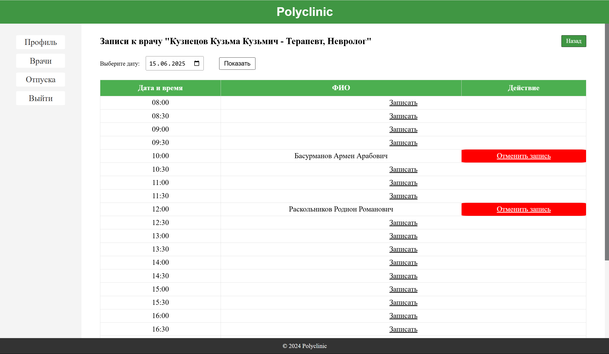
</figure>

<figure>
<figcaption>Создание новой записи на прием:</figcaption>
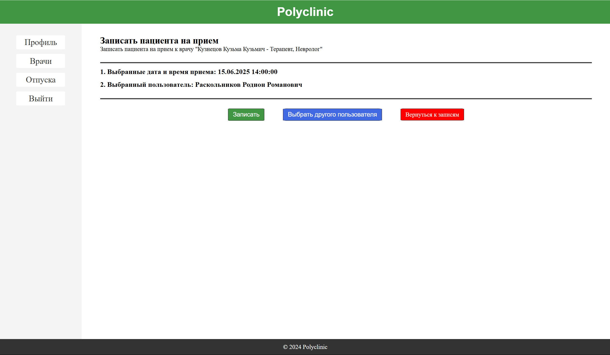
</figure>

<figure>
<figcaption>Управление расписанием врачей:</figcaption>
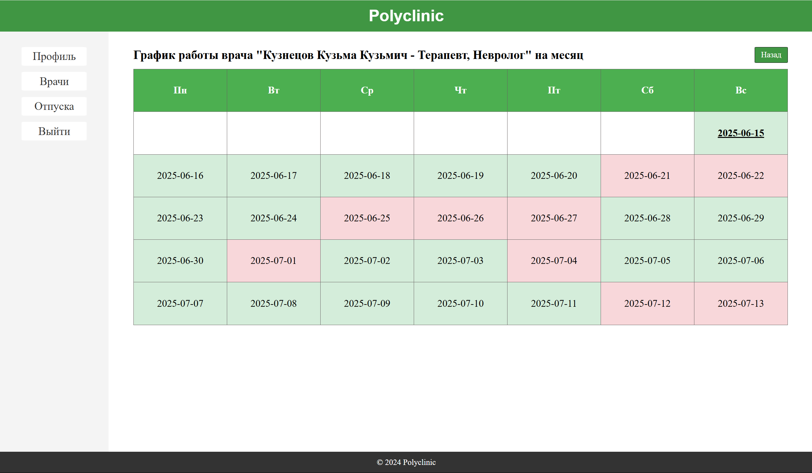
</figure>

<figure>
<figcaption>Управление отпусками врачей:</figcaption>
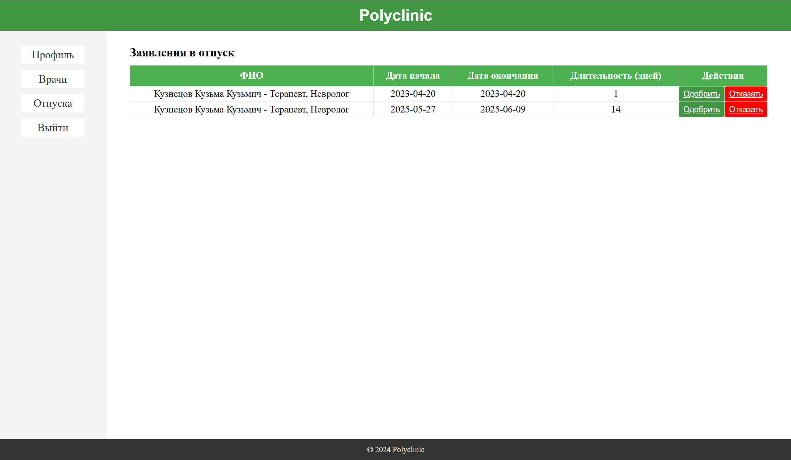
</figure>
</details>

<details>
<summary>👨‍⚕️ Возможности врача</summary>

<figure>
<figcaption>Список врачей поликлиники:</figcaption>

</figure>

<figure>
<figcaption>Просмотр записей на прием:</figcaption>
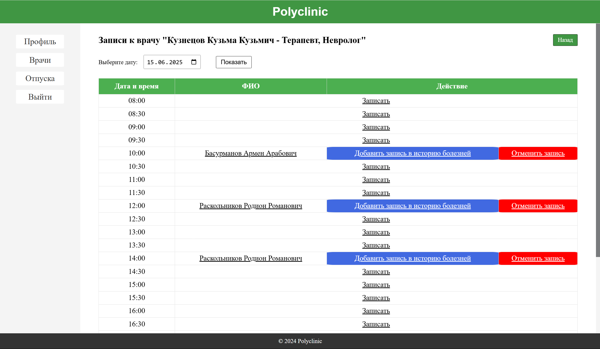
</figure>

<figure>
<figcaption>Создание записи на прием:</figcaption>

</figure>

<figure>
<figcaption>История медицинской карты пациента:</figcaption>
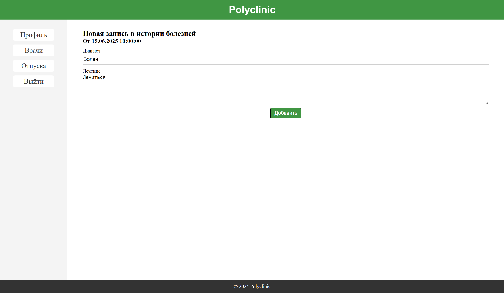
</figure>

<figure>
<figcaption>Создание заявки на отпуск:</figcaption>
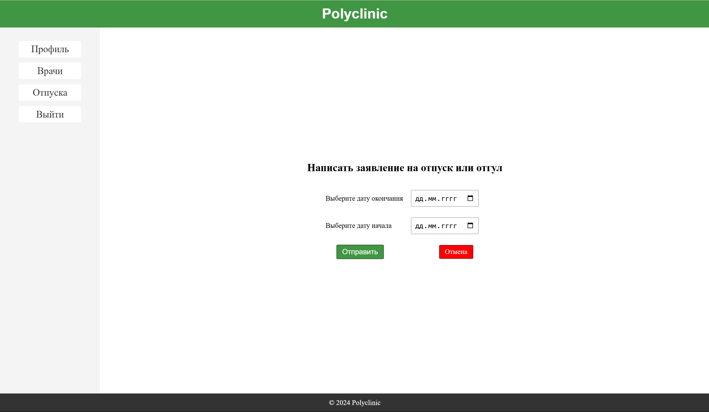
</figure>
</details>

## Установка

1. Убедитесь, что у вас установлены:
   - Java 17 или выше
   - Maven
   - Docker

2. Клонируйте репозиторий:
```bash
git clone https://github.com/almost-wizard/polyclinic-web.git
cd polyclinic-web
```

3. Запустите приложение в Docker:
```bash
docker-compose up -d --build
```

## Доступ к приложению

- Веб-интерфейс: http://localhost:8080
- База данных Oracle: localhost:1521
  - SID: XEPDB1
  - Пользователь: oracule_user_app
  - Пароль: app_password
- Стандартные пользователи СИС (пароль любого пользователя - `123`):
  - Системный администратор: `admin`
  - Модератор: `moderator`
  - Администратор поликлиники: `sidor`
  - Врачи: `doctor1`, `doctor2`
  - Пациенты: `patient1`, `patient2`

## Роли пользователей

- Системный администратор
- Модератор
- Администратор
- Врач
- Пациент

## Структура проекта

```
polyclinic-web/
├── src/
│   └── main/
│       ├── java/
│       │   ├── controller/    # Контроллеры
│       │   ├── dao/           # Data Access Objects
│       │   ├── model/         # Модели данных
│       │   ├── command/       # Команды
│       │   └── service/       # Бизнес-логика
│       ├── webapp/            # JSP страницы
│       └── resources/         # Конфигурационные файлы
├── init-sql/                  # SQL скрипты инициализации
├── Dockerfile                 # Конфигурация Docker
└── docker-compose.yml         # Конфигурация Docker Compose
```

## Технологии

- Java 17
- JSP
- Apache Tomcat
- Oracle Database
- Maven
- Docker
- HTML/CSS/JavaScript

## Системные требования

- 4GB RAM
- 10GB свободного места
- Docker

---

⭐ Не забудьте поставить звезду репозиторию, если вам понравился проект!
